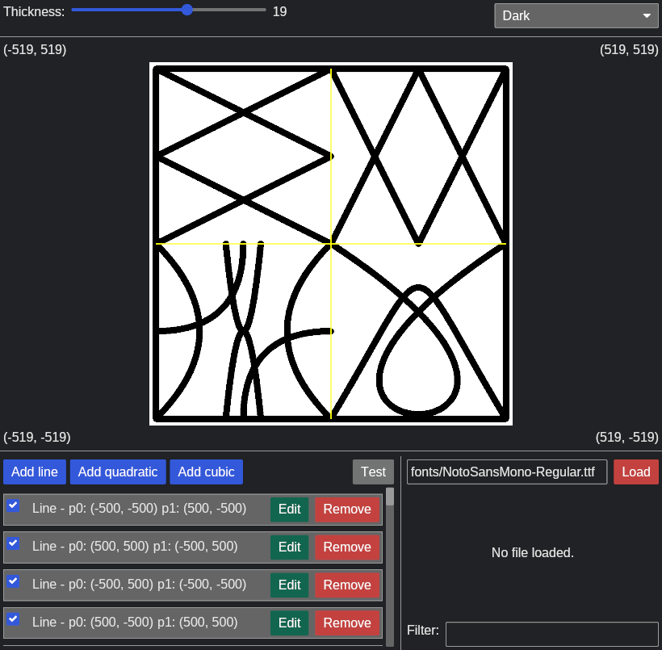
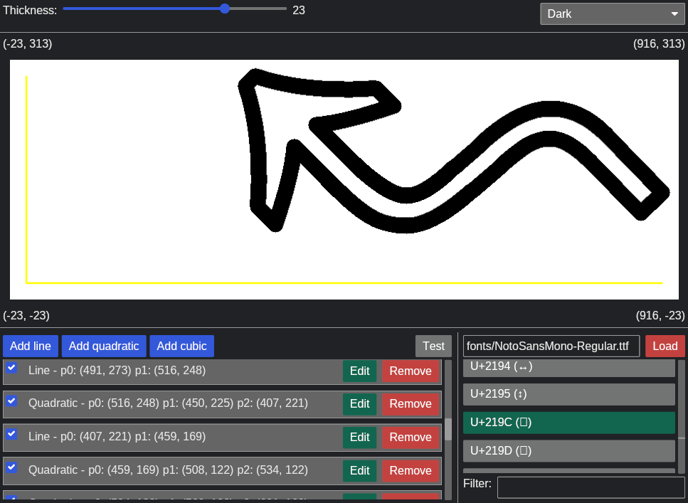

# Font View

This project was created to help me explore how truetype fonts are defined. To do that, I first needed a program that could draw lines as well as quadratic and cubic Bézier curves. Once that worked, I could load the lines/curves that defined a character.

Performance wise the program is "good enough." The code to calculate straight lines is pretty standard, the code to draw curves is all integer math but could probably be improved. The code to apply a "stroke" to the lines/curves is rudimentary. I started going down the path (rathole) of offset curves and realized I was getting distracted from my goal. So for the stroke, instead of setting a single pixel I set all the pixels within the stroke radius.

Ultimatly this application should be viewed as an example rather than something useful.

## Screen Shots

### Lines to test the code

### Outline of a character

